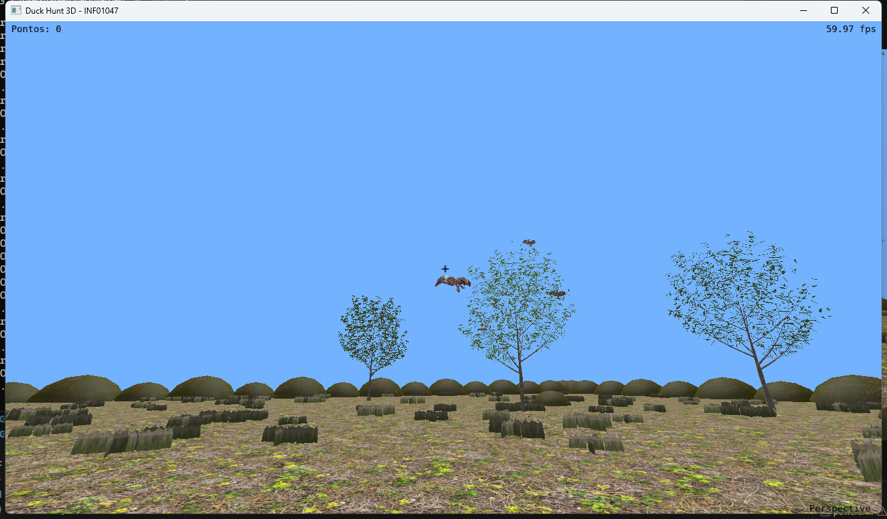
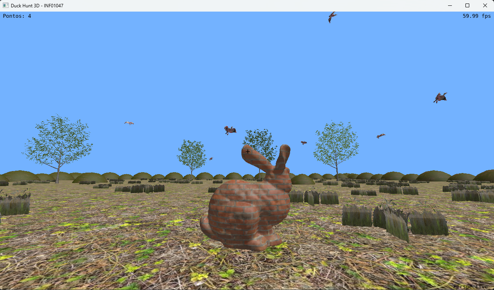

# Duck Hunt 3D

Trabalho final de Computação Gráfica e Visualização I (INF01047) - UFRGS.
Feito por Rafael Benjamin Bombach - cartão 00342854
## Sobre o jogo

É uma versão em 3D do Duck Hunt feita em C++ com OpenGL. O jogador anda em
primeira pessoa por um campo com chão, grama, pedras e árvores, e atira nos
patos que voam pelo céu. Os patos seguem trajetórias de curvas de Bézier.
Para acertar, basta mirar na cruzeta do centro da tela e clicar. Quando
atingido, o pato cai girando e o placar sobe. O jogo tem câmera de primeira
e terceira pessoa, iluminação e texturas em todos os objetos, som de tiro e
som de pato ao acertar, menu de pausa e modo tela cheia.

## Contribuições

O trabalho foi feito individualmente por Rafael Benjamin Bombach.

## Uso de IA

Utilizei o Claude (da Anthropic) para desenvolver grande parte do código,
descrevendo o que queria implementar e corrigindo os resultados. A ferramenta
foi muito útil para acelerar partes técnicas como shaders, carregamento de
modelos e colisões. Por outro lado, quando algo não funcionava visualmente
(como as folhas das árvores sumindo ou a textura do chão parecendo se mover),
a IA nem sempre acertou de primeira e precisei testar e redirecionar várias
vezes. No geral ajudou bastante.

## Imagens





## Como jogar

W A S D — Andar
Mouse — Olhar e mirar
Clique esquerdo — Atirar
C — Alternar câmera 1ª / 3ª pessoa
P / O — Perspectiva / ortográfica
F11 — Tela cheia
ESC — Menu de pausa
+ / - — Ajustar volume
H — Esconder texto na tela
R — Recarregar shaders

## Como compilar e rodar

Testado no Windows com GCC do MSYS2 (UCRT64) e CMake. No Linux também funciona.

```bash
cmake -B build -S .
cmake --build build
```

O executável fica em `bin/Debug/main.exe`. Rode a partir da pasta `bin/Debug`
pois os modelos e texturas são carregados por caminhos relativos:

```bash
cd bin/Debug
./main.exe
```

Também dá pra abrir no VSCode com as extensões C/C++ e CMake Tools e usar
o botão de Play na barra inferior.